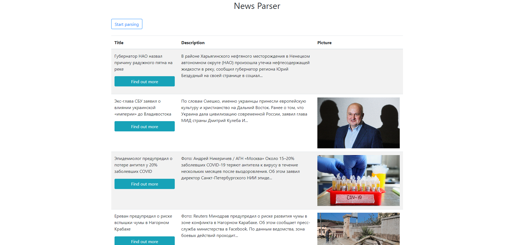

## News Parser

Application environment:

- Laravel 7.13 (PHP 7.4) / NGINX
- MySQL 5.7
- Deploying: docker, docker-compose, composer

### Deploy process

- clone repository into any dir: `git clone https://github.com/vrungel76/parser.git your_dir_name/`.
- go to the dir: `cd your_dir_name`.
- run process of building and running images: `docker-compose up -d --build`.

Now you have containers, and it's time to install application   

- go into PHP container: `docker exec -it parser-php bash`.
- copy prepared local .env: `cp .env.example .env`
- install dependencies: `composer install`.
- create DB: `./artisan migrate`

All is done. Now run your favorite browser and type the URL: `localhost:8088`
